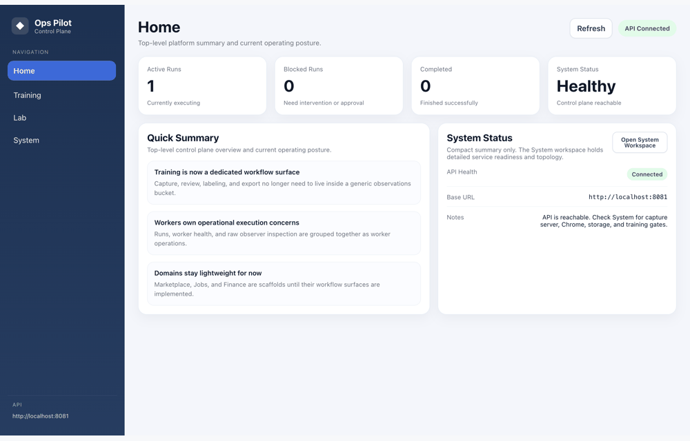
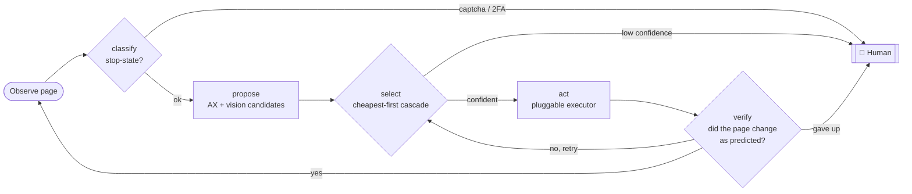
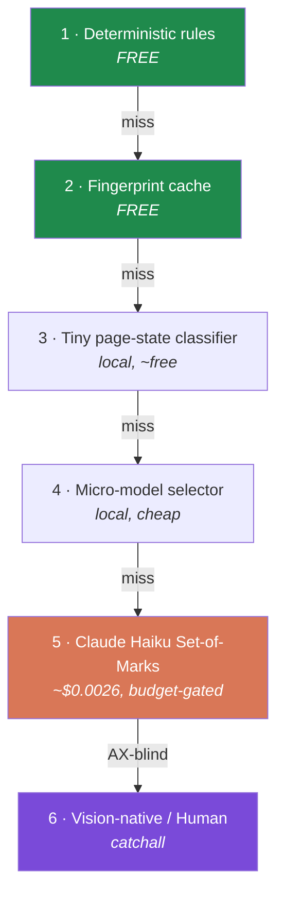
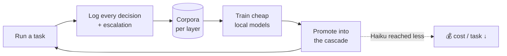
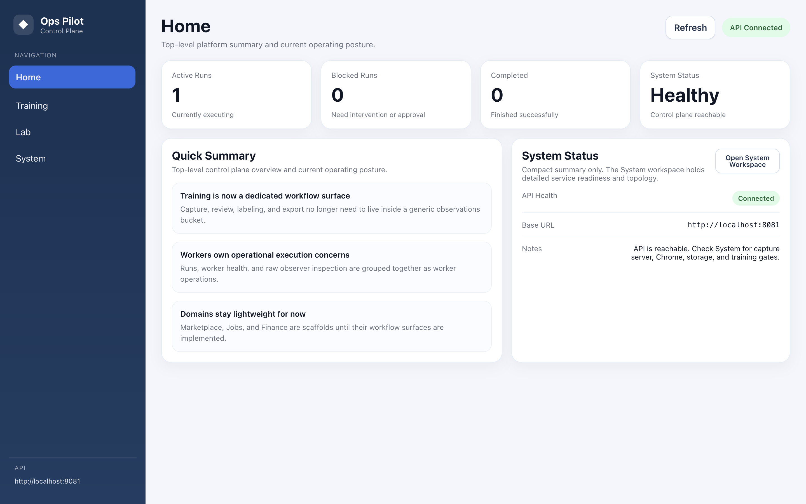
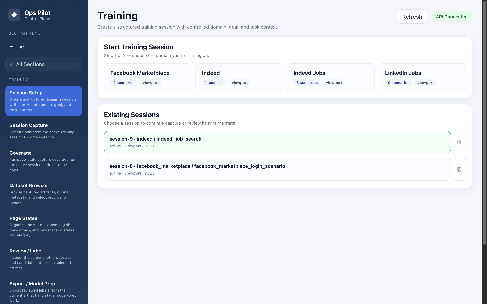
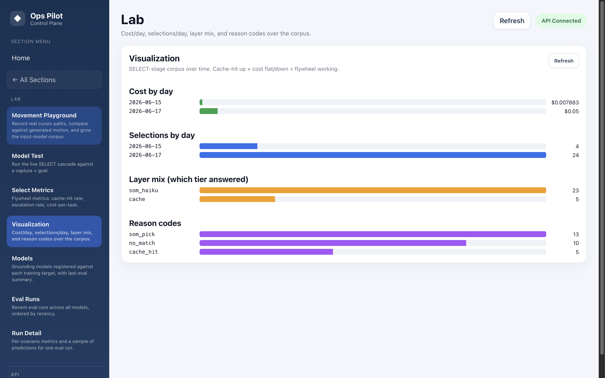
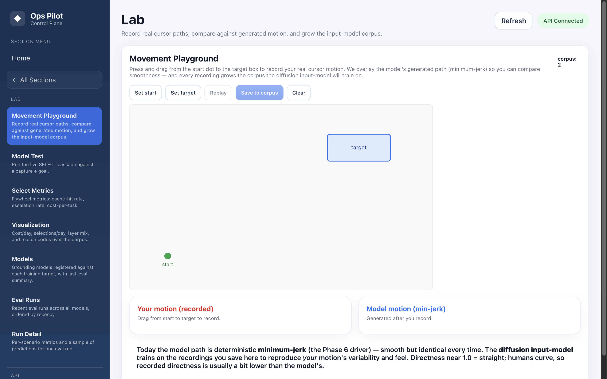

<div align="center">

# 🧭 Ops Pilot

### A **supervised browser agent** that gets *cheaper and more autonomous* the longer it runs.

Not a scraper. A per-step decision loop where every action is made by the **cheapest tool that's confident**, a human catches anything uncertain, and every correction becomes training data for **local models that take work off the expensive LLM**.



<br/>


</div>

---

## Why this isn't a web scraper

A scraper reads a fixed page and pulls fields. **Ops Pilot operates a browser like a careful human would** — it looks at the live page, decides *what to do next*, does it, and checks the result, step after step, across states it has never seen.

| A scraper… | Ops Pilot… |
|---|---|
| Parses a known DOM | **Perceives** an arbitrary page (accessibility tree **+ vision** when the AX tree lies) |
| Follows a hard-coded path | **Decides** each step with a cheapest-first cascade |
| Breaks on a new layout / captcha | **Escalates** stop-states (captcha, 2FA, checkpoints) to a human, $0 |
| Costs the same forever | **Gets cheaper over time** — it trains local models from its own corrections |
| Fire-and-forget | **Supervised** — budget-capped, human-in-the-loop, every decision logged |

It's a **framework for building reliable web automation that improves itself** — perception, decision, action, and verification as separate, swappable, individually-trainable stages.

---

## The per-step loop

Every step runs the same five stages. Each is the *cheapest tool that's still confident*; anything uncertain stops for a human.



| Stage | What it does | How |
|---|---|---|
| **classify** | Is this a STOP screen? (captcha / 2FA / checkpoint) | rules → escalate to human, $0 |
| **propose** | Candidate elements on the page | raw CDP accessibility tree (role + name + bbox), vision fallback when AX is blind |
| **select** | Pick the target | the cascade below |
| **act** | Move + click / type | pluggable executor drivers (style varies; intent is canonical) |
| **verify** | Did it work? | AX/DOM delta vs. prediction → retry once → escalate |

---

## The cheapest-first cascade (the "inner loop")

The whole cost story lives here. A decision falls through layers until one is confident — and **expensive layers exist only as a catchall**.



> Today, work is done by **Layer 2 (cache)** and **Layer 5 (Haiku)**. Layers 1/3/4 are deliberately empty — **they get *earned from data*** once the logs show Haiku is being reached too often. Don't build models ahead of evidence.

---

## The flywheel 🛞 — why it gets cheaper

This is the thesis. Haiku isn't the product; it's the **teacher**.



Each run logs the expensive model's picks and the human's corrections. Those become a **distillation corpus** for tiny local models that slot into the cascade and answer for free — so the same task gets **cheaper and more autonomous the longer it runs**. A hard **$5/week autonomous-spend cap** keeps the teacher honest.

---

## Inside the app

<table>
<tr>
<td width="50%"><br/><b>Control plane</b> — operating posture at a glance: active runs, blocked runs needing a human, system health.</td>
<td width="50%"><br/><b>Structured capture</b> — every data point is scoped to a domain · goal · scenario session with its own isolated Chrome.</td>
</tr>
<tr>
<td width="50%"><br/><b>Flywheel metrics</b> — cost/day, layer mix, and reason codes over the live corpus. Cache-hit ↑ + cost flat = the wheel is turning.</td>
<td width="50%"><br/><b>Movement Playground</b> — record real cursor paths vs. the model's motion, growing the corpus for a diffusion-based human-like input model.</td>
</tr>
</table>

> The UI also includes a per-page-state **Coverage tracker** (drive data collection to the gaps), a live **Model Test** bench (run the SELECT cascade against any capture), and an **Eval Runs / Model Registry** for the grounding models.

---

## The model roster

Nothing in the loop is a trained model *yet* — that's by design (collect data first, train later). Each has its own corpus, trainer, and a shared eval contract so it can be retrained independently as data accumulates.

| Model | Role | Trains from |
|---|---|---|
| **Page-state classifier** | perception / cascade L3 | tagged captures (login wall, feed, captcha, …) |
| **Micro-model selector** | cascade L4 | the SELECT telemetry (Haiku's picks = labels) |
| **Diffusion input model** | `act` / human-like cursor motion | recorded Movement-Playground trajectories |
| **Vision element grounding** | `propose` super-fallback | training captures + labels |
| **State-transition / outcome** | look-ahead & task success | per-step trajectory corpus |

---

## Tech stack

| Layer | Tech |
|---|---|
| **Decision engine** | Python · pure port-based loop (unit-tested without a browser) |
| **Perception** | raw **Chrome DevTools Protocol** (accessibility tree + box model), Set-of-Marks vision |
| **Reasoning (catchall)** | **Claude Haiku 4.5** via the Anthropic API, prompt-cached & budget-gated |
| **Control plane** | **FastAPI** · SQLAlchemy · **Postgres** · Redis |
| **Frontend** | **React** + Vite |
| **Infra** | Docker Compose (local), corpora as append-only JSONL |

---

## Project status

**Phase: multi-domain data collection** — building the corpora that the cheap local layers will train on.

- ✅ Per-step loop, cheapest-first cascade, verifier, and all guardrails — **built & tested**
- ✅ Capture → corpus → coverage pipeline across multiple domains (Facebook, Indeed, …)
- ✅ Stop-state escalation verified on real reCAPTCHA & 2FA
- 🔜 First trainable model: the **page-state classifier** (L3)
- 🔜 Continuous retraining → the full self-improving flywheel

<details>
<summary><b>Guardrails & safety</b></summary>

- **$5/week autonomous spend cap**, enforced before every paid call
- **Human escalation** on stop-state, over-budget, low-confidence, no-match, or verifier-fail
- **Record-only by default** — the loop logs its decided intent and fires nothing until trusted
- **Never auto-solves captchas** — those are a human gate by design
- Credentials live only in a git-ignored `.env`, never logged

</details>

---

<details>
<summary><b>Local development</b></summary>

### Repo layout
- `apps/controlplane-api` — FastAPI control plane, training & runtime APIs
- `apps/mcp` — capture server + observer pipeline (CDP-AX proposer)
- `apps/controlplane-ui` — Vite/React frontend
- `infra` — local Postgres & Redis via Docker Compose
- `scripts` — dev startup, shutdown, health-check helpers

### One command
```bash
make dev
```
Starts Postgres, Redis, the Control Plane API (`:8081`), the Capture Server (`:8082`), and the UI (`:5173`). Training Chrome is launched on demand per session from the UI. First run also creates `.venv`, installs Python deps, and runs `npm ci`.

```bash
make setup     # first-time env setup only
make dev-stop  # stop everything
make doctor    # health check
```

The virtual environment lives at `.venv`; the dev scripts call `.venv/bin/python` directly, so no manual activation is needed.

### Then, in the UI
1. Open **Training** → create a session (domain · goal · scenario)
2. Start **Session Chrome**
3. **Capture** against that session-scoped browser

</details>

---

<div align="center">
<sub>Built as a study in <b>resource-efficient, self-improving</b> web automation — perception, decision, action, and verification as separate, individually-trainable stages.</sub>
</div>
